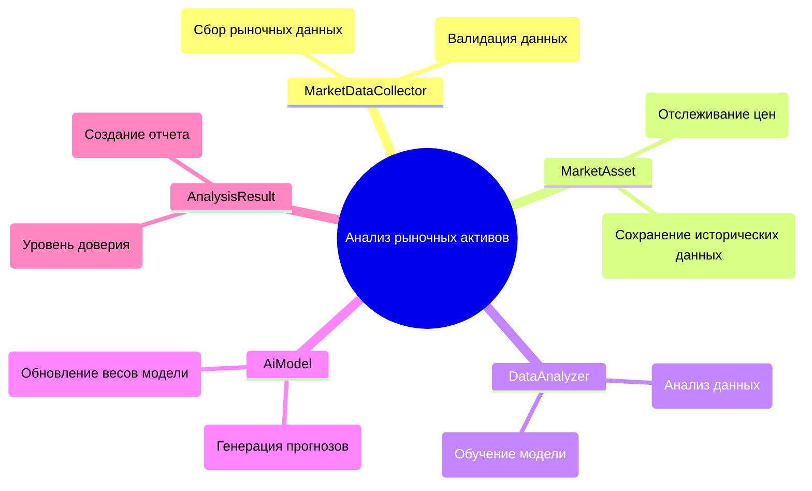
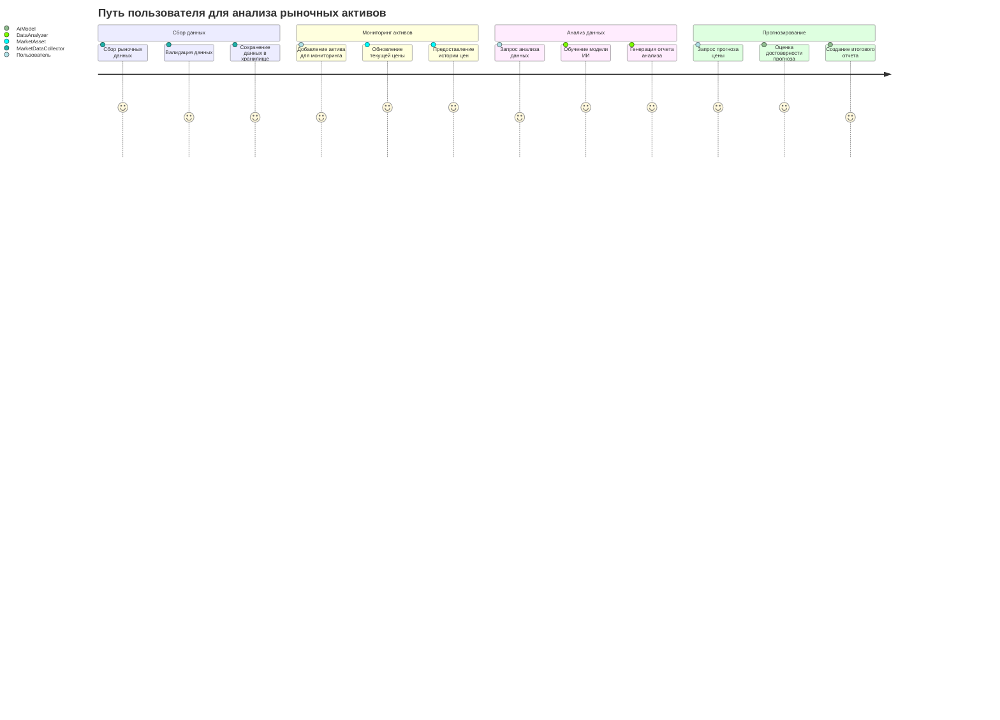
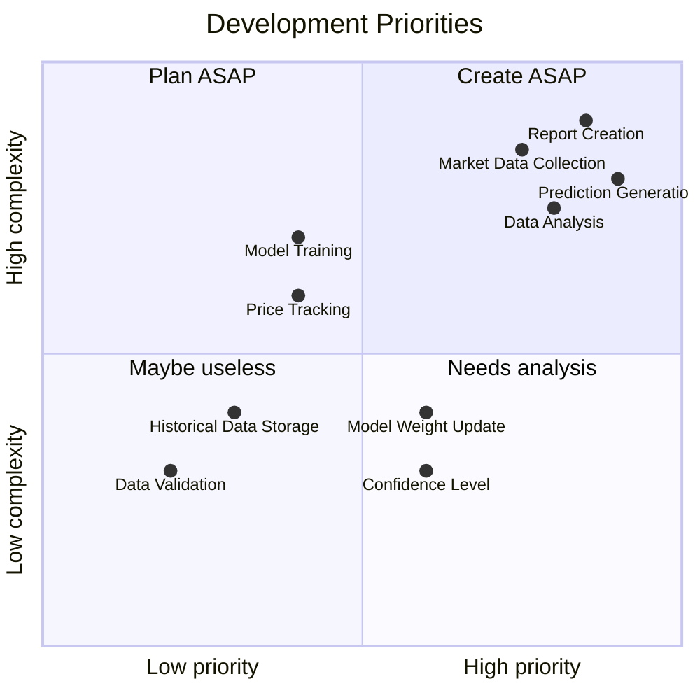
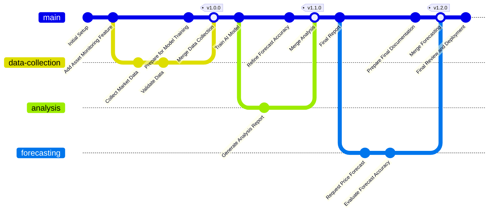

# pkss_prac12

## MindMap

```mermaid
mindmap
  root((Анализ рыночных активов))
    MarketDataCollector
      CollectData("Сбор рыночных данных")
      ValidateData("Валидация данных")
    MarketAsset
      TrackPrice("Отслеживание цен")
      HistoricalData("Сохранение исторических данных")
    DataAnalyzer
      AnalyzeData("Анализ данных")
      TrainModel("Обучение модели")
    AiModel
      MakePredictions("Генерация прогнозов")
      UpdateWeights("Обновление весов модели")
    AnalysisResult
      GenerateSummary("Создание отчета")
      ConfidenceLevel("Уровень доверия")

```

## UserJourney Diagram

```mermaid
journey
    title Путь пользователя для анализа рыночных активов
    section Сбор данных
      Сбор рыночных данных: 5: MarketDataCollector
      Валидация данных: 4: MarketDataCollector
      Сохранение данных в хранилище: 4: MarketDataCollector
    section Мониторинг активов
      Добавление актива для мониторинга: 4: Пользователь
      Обновление текущей цены: 5: MarketAsset
      Предоставление истории цен: 5: MarketAsset
    section Анализ данных
      Запрос анализа данных: 4: Пользователь
      Обучение модели ИИ: 5: DataAnalyzer
      Генерация отчета анализа: 5: DataAnalyzer
    section Прогнозирование
      Запрос прогноза цены: 5: Пользователь
      Оценка достоверности прогноза: 5: AiModel
      Создание итогового отчета: 4: AiModel
```

## Graph-quadrant

```mermaid
quadrantChart
  title Development Priorities
  x-axis Low priority --> High priority
  y-axis Low complexity --> High complexity
  quadrant-1 Create ASAP
    Market Data Collection: [0.75, 0.85]
    Data Analysis: [0.8, 0.75]
    Prediction Generation: [0.9, 0.8]
    Report Creation: [0.85, 0.9]
  quadrant-2 Plan ASAP
    Model Training: [0.4, 0.7]
    Price Tracking: [0.4, 0.6]
  quadrant-3 Maybe useless
    Data Validation: [0.2, 0.3]
    Historical Data Storage: [0.3, 0.4]
  quadrant-4 Needs analysis
    Model Weight Update: [0.6, 0.4]
    Confidence Level: [0.6, 0.3]

```

## Git graph

```mermaid
gitGraph
    commit id: "Initial Setup"
    commit id: "Add Asset Monitoring Feature"
    branch data-collection
    checkout data-collection
    commit id: "Collect Market Data"
    commit id: "Validate Data"
    checkout main
    commit id: "Prepare for Model Training"
    merge data-collection id: "Merge Data Collection" tag: "v1.0.0"
    commit id: "Train AI Model"
    branch analysis
    checkout analysis
    commit id: "Generate Analysis Report"
    checkout main
    commit id: "Refine Forecast Accuracy"
    merge analysis id: "Merge Analysis" tag: "v1.1.0"
    commit id: "Final Report"
    branch forecasting
    checkout forecasting
    commit id: "Request Price Forecast"
    commit id: "Evaluate Forecast Accuracy"
    checkout main
    commit id: "Prepare Final Documentation"
    merge forecasting id: "Merge Forecasting" tag: "v1.2.0"
    commit id: "Final Review and Deployment"

```
